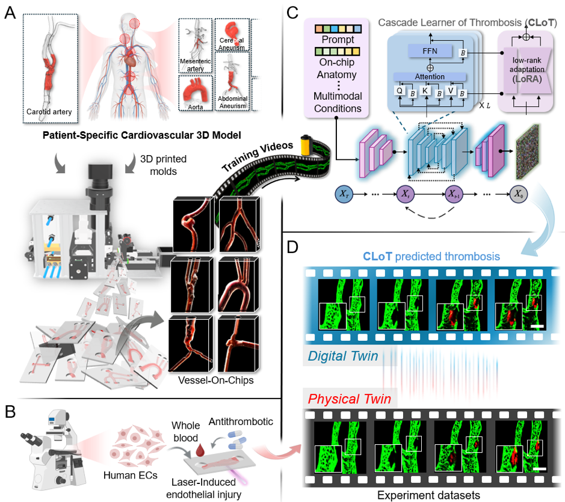
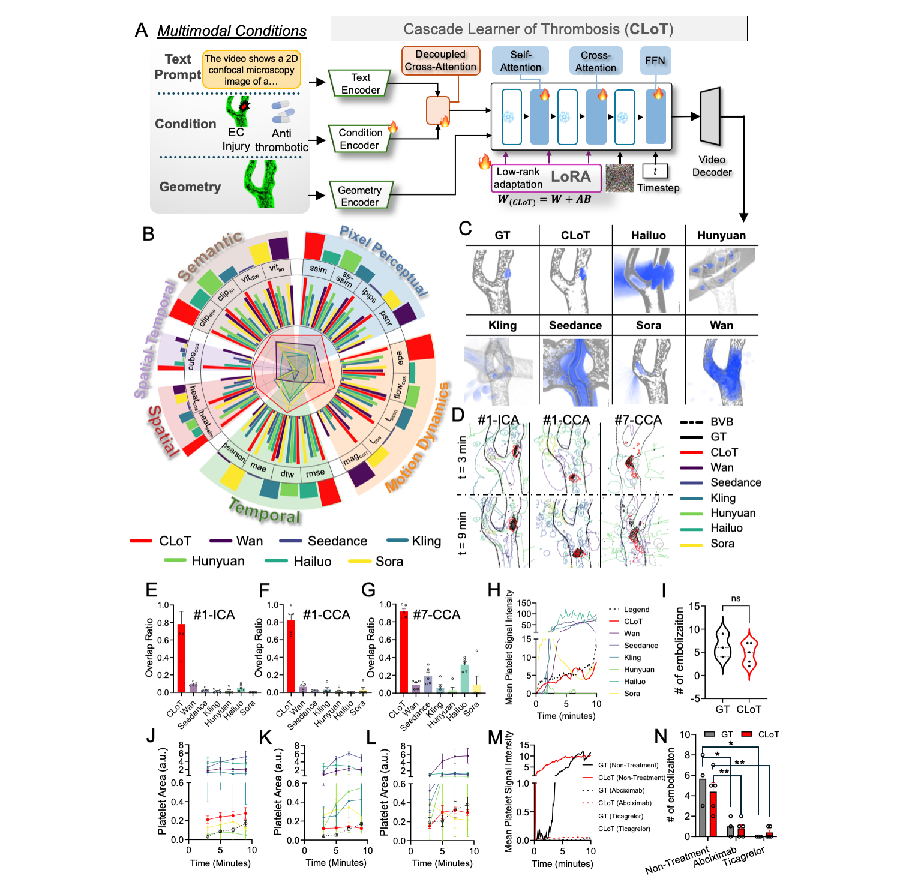

<h1 align="center">Automated high-throughput fabrication of patient-specific vessel-on-chips enables a generative AI digital twin—Cascade Learner of Thrombosis (CLoT) for personalized thrombosis prediction
</h1>
<p align="center">
<a href="[https://www.biorxiv.org/content/10.64898/2026.03.03.709446v1](https://www.biorxiv.org/content/10.64898/2026.03.03.709446v1)">.svg" ></a>
<h4 align="center">This is the official repository of the paper <a href="https://www.biorxiv.org/content/10.64898/2026.03.03.709446v1">Automated high-throughput fabrication of patient-specific vessel-on-chips enables a generative AI digital twin—Cascade Learner of Thrombosis (CLoT) for personalized thrombosis prediction</a>.</h4>
<h5 align="center"><em>Zihao Wang*, Yunduo Charles Zhao*, Haimei Zhao*, Arian Nasser, Nicole Alexis Yap, Yanyan Liu, Allan Sun, Wei Chen, Timothy Ang, Ken S Butcher, Lining Arnold Ju†
</em></h5>
<p align="center">
  <a href="#news">News</a> |
  <a href="#abstract">Abstract</a> |
  <a href="#method">Method</a> |
  <a href="#results">Results</a> |
  <a href="#environment">Environment</a> |
  <a href="#code">Code</a> |
  <a href="#statement">Statement</a>
</p>

## News
- **(2026/03/05)** CLoT is released on [BioArXiv](https://www.biorxiv.org/content/10.64898/2026.03.03.709446v1).

## Abstract

The organ-on-a-chip field promises human-relevant disease modeling to replace animal testing, yet scale-up is limited by labor-intensive fabrication. Meanwhile, artificial intelligence (AI) has emerged as a transformative tool for disease prediction and drug screening, but its integration with organ-on-chips has been hindered by insufficient experimental datasets. Here, we introduce an automated fabrication platform capable of producing patient-specific vessel-on-chips at unprecedented throughput—80 fully functional chips within 20 hours of clinical image acquisition (10 hours fabrication + 10 hours biofunctionalization). Human blood-perfusion assays across these individualized chips create a high-fidelity “physical twin” library of thrombosis dynamics encompassing diverse anatomies, vascular injuries, and pharmacological interventions. Leveraging this dataset, we trained a generative AI “digital twin” (Cascade Learner of Thrombosis; CLoT) by fine-tuning a pretrained diffusion transformer via low-rank adaptation (LoRA) to synthesize realistic thrombosis videos. Compared with leading commercial video-generation models (Sora, Wan, Hunyuan, Kling, Seedance, Hailuo), CLoT achieves 5.3-fold higher vascular consistency and 7.38-fold greater thrombosis similarity. Prospective validation on unseen patient geometries and drug combinations yields >90% spatiotemporal agreement with experimental ground truth, establishing proof-of-concept for AI-driven personalized medicine while eliminating animal testing. This paradigm—automated “physical twin” production coupled with generative AI “digital twin”—represents a transformative approach for personalized thrombosis prediction and therapeutics.The organ-on-a-chip field promises human-relevant disease modeling to replace animal testing, yet scale-up is limited by labor-intensive fabrication. Meanwhile, artificial intelligence (AI) has emerged as a transformative tool for disease prediction and drug screening, but its integration with organ-on-chips has been hindered by insufficient experimental datasets. Here, we introduce an automated fabrication platform capable of producing patient-specific vessel-on-chips at unprecedented throughput—80 fully functional chips within 20 hours of clinical image acquisition (10 hours fabrication + 10 hours biofunctionalization). Human blood-perfusion assays across these individualized chips create a high-fidelity “physical twin” library of thrombosis dynamics encompassing diverse anatomies, vascular injuries, and pharmacological interventions. Leveraging this dataset, we trained a generative AI “digital twin” (Cascade Learner of Thrombosis; CLoT) by fine-tuning a pretrained diffusion transformer via low-rank adaptation (LoRA) to synthesize realistic thrombosis videos. Compared with leading commercial video-generation models (Sora, Wan, Hunyuan, Kling, Seedance, Hailuo), CLoT achieves 5.3-fold higher vascular consistency and 7.38-fold greater thrombosis similarity. Prospective validation on unseen patient geometries and drug combinations yields >90% spatiotemporal agreement with experimental ground truth, establishing proof-of-concept for AI-driven personalized medicine while eliminating animal testing. This paradigm—automated “physical twin” production coupled with generative AI “digital twin”—represents a transformative approach for personalized thrombosis prediction and therapeutics.

## Method


## Results

### Quantitative and Qualitative results on validation set



### Environment
- torch>=2.0.0
- torchvision
- cupy-cuda12x
- transformers==4.46.2
- controlnet-aux==0.0.7
- imageio
- imageio[ffmpeg]
- safetensors
- einops
- sentencepiece
- protobuf
- modelscope
- ftfy
 

## Data

### Evaluation set
Download the evaluation dataset from [here](https://drive.google.com/drive/folders/1tKVy4yTWUl2xba8eJRjt7uVtlx_2QebR?usp=drive_link), then prepare data folders as follows:
```
./
├── 
├── ...
└── path_to_data_shown_in_config/
    └──geometry/
        ├── 01/           
        │   ├── input/	
        |   |	├── G1-original.jpg
        |   |	├── G1-ablation.jpg
        |   |	└── prompt.txt
        |   | └── ...
        │   └── labels/ 
        |       ├── Geometry-G1-f65-GT.mp4
        |       └── ...
        └── 07/
```

## Code
### Training
```plain
python training/train_Clot.py --task train --train_architecture lora --dataset_path E:\TrainingData-lasercut-drug\ --output_path ./models --steps_per_epoch 50 --max_epochs 10 --learning_rate 1e-4 --lora_rank 16 --lora_alpha 16 --lora_target_modules "q,k,v,o,ffn.0,ffn.2" --accumulate_grad_batches 1 --use_gradient_checkpointing --height 512 --width 512 --num_frames 65 --image_encoder_path "models/Wan-AI/Wan2.1-I2V-14B-480P/models_clip_open-clip-xlm-roberta-large-vit-huge-14.pth" --use_gradient_checkpointing_offload
```
### Inference
```plain
python inference/clot_vessel_generation.py
```
### Evaluation
```plain
python evaluation/video_eval_bio_multi-all.py
```

## Statement
@article {Wang2026.03.03.709446,
	author = {Wang, Zihao and Zhao, Yunduo Charles and Zhao, Haimei and Nasser, Arian and Yap, Nicole Alexis and Liu, Yanyan and Sun, Allan and Chen, Wei and Butcher, Ken S and Ang, Timothy and Ju, Lining Arnold},
	title = {Automated high-throughput fabrication of patient-specific vessel-on-chips enables a generative AI digital twin{\textemdash}Cascade Learner of Thrombosis (CLoT) for personalized thrombosis prediction},
	elocation-id = {2026.03.03.709446},
	year = {2026},
	doi = {10.64898/2026.03.03.709446},
	URL = {https://www.biorxiv.org/content/early/2026/03/05/2026.03.03.709446},
	eprint = {https://www.biorxiv.org/content/early/2026/03/05/2026.03.03.709446.full.pdf},
	journal = {bioRxiv}
}

